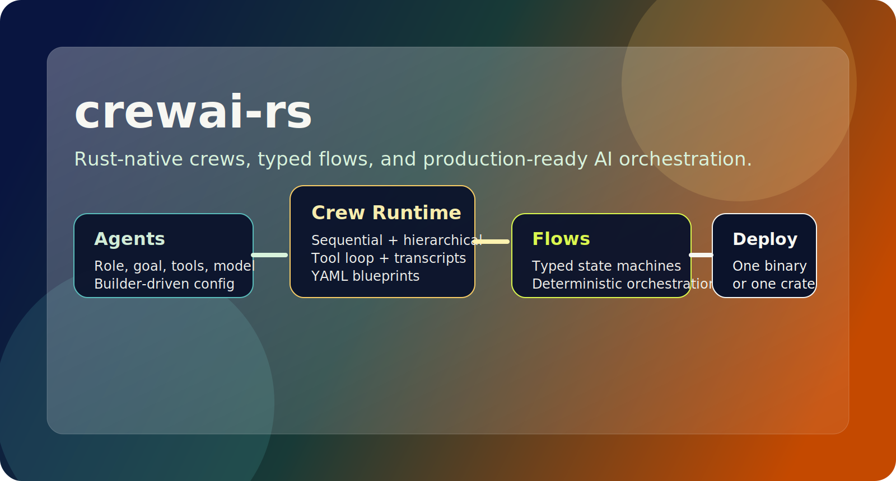
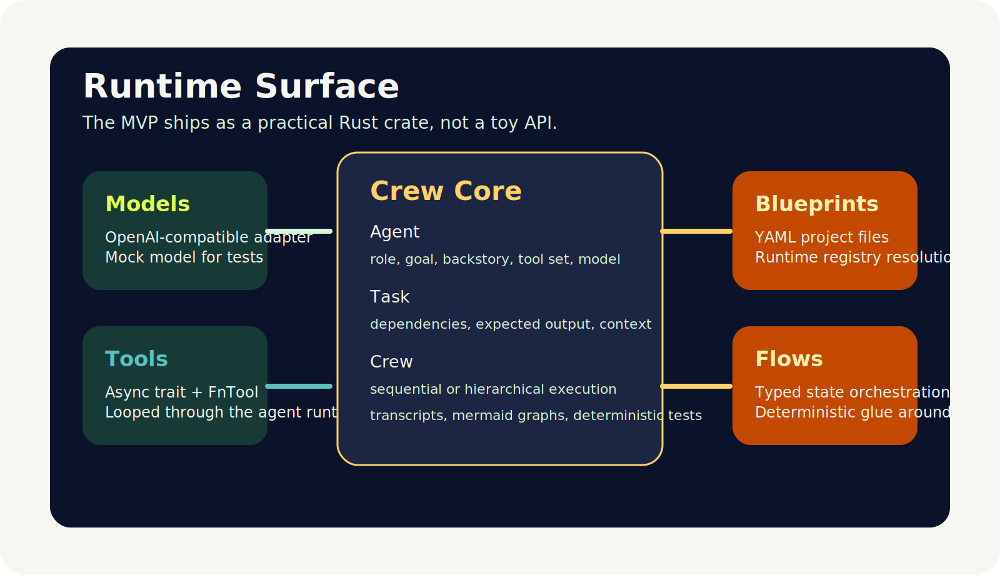
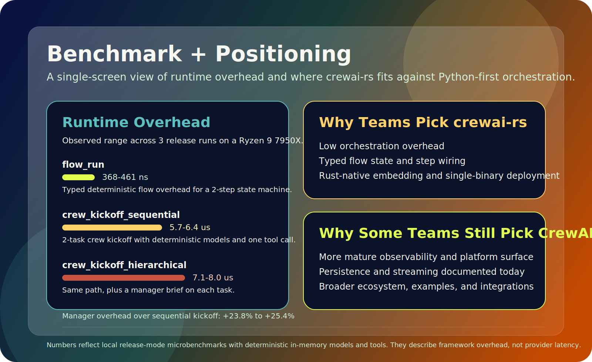

# crewai-rs

<p align="center">
  
</p>

<p align="center">
  <a href="https://github.com/LongWeihan/crewai-rs/actions/workflows/ci.yml"></a>
  <a href="https://github.com/LongWeihan/crewai-rs/stargazers"></a>
  
  <a href="./LICENSE"></a>
  
  
</p>

Rust-native multi-agent orchestration inspired by CrewAI.

`crewai-rs` gives you a practical MVP stack for building agent crews in Rust:

- typed `Agent`, `Task`, and `Crew` primitives
- sequential and hierarchical execution
- tool-calling with a lightweight XML/JSON protocol
- YAML blueprints for config-driven crews
- typed `Flow` state machines for deterministic workflow steps
- `MockChatModel` for deterministic tests
- `OpenAIChatModel` for real deployments and OpenAI-compatible endpoints

## Why this exists

The current AI orchestration ecosystem is still heavily Python-first. That is fine for experiments, but not ideal for:

- low-latency task orchestration
- stable binary deployments
- stronger type guarantees across flows and state
- production services that need concurrency without runtime surprises

`crewai-rs` is built to be idiomatic Rust first, not a line-by-line port.

## Install

```toml
[dependencies]
crewai-rs = "0.1.0"
tokio = { version = "1", features = ["macros", "rt-multi-thread"] }
```

## Quick Start

```rust
use std::sync::Arc;

use crewai_rs::prelude::*;

#[tokio::main]
async fn main() -> crewai_rs::Result<()> {
    let search = Arc::new(FnTool::new(
        "search",
        "Find launch signals from the web index.",
        |input| async move {
            Ok(ToolOutput::text(format!(
                "Top hit for `{}`: Rust developers want a typed CrewAI alternative.",
                input.value
            )))
        },
    ));

    let researcher_model = Arc::new(MockChatModel::from_strings(
        "mock-researcher",
        [
            r#"<tool_call>{"tool":"search","input":"CrewAI Rust launch opportunities"}</tool_call>"#,
            r#"<final_answer>- Demand is real
- Typed flows are a differentiator
- Early adopters care about OpenAI-compatible backends</final_answer>"#,
        ],
    ));

    let writer_model = Arc::new(MockChatModel::from_strings(
        "mock-writer",
        [r#"<final_answer># Launch Brief

Ship `crewai-rs` as the Rust-native way to build crews, typed flows, and durable AI orchestration.</final_answer>"#],
    ));

    let researcher = Agent::builder("researcher")
        .role("Launch Researcher")
        .goal("Find the sharpest positioning for a Rust AI crew framework.")
        .backstory("You turn weak launch ideas into high-signal product narratives.")
        .model_ref(researcher_model)
        .tool_ref(search)
        .build()?;

    let writer = Agent::builder("writer")
        .role("Technical Writer")
        .goal("Turn research into a polished launch-ready brief.")
        .model_ref(writer_model)
        .build()?;

    let research = Task::builder("research-market")
        .description("Research the market gap for a Rust-native CrewAI-style framework.")
        .expected_output("A concise markdown bullet list with launch hooks.")
        .agent("researcher")
        .build()?;

    let brief = Task::builder("write-brief")
        .description("Write a crisp launch brief for GitHub and X.")
        .expected_output("A markdown brief with one clear positioning sentence.")
        .agent("writer")
        .depends_on(["research-market"])
        .build()?;

    let crew = Crew::builder("launch-crew")
        .agent(researcher)
        .agent(writer)
        .task(research)
        .task(brief)
        .build()?;

    let result = crew
        .kickoff(
            KickoffInput::new("Prepare the strongest possible public launch story.")
                .with_context("target_audience", "Rust builders shipping AI products"),
        )
        .await?;

    println!("{}", result.final_output);
    Ok(())
}
```

Run the example in this repo:

```bash
cargo run --example mock_launch
```

## YAML Blueprints

`crewai-rs` lets you define a crew in YAML, then attach live models and tools from a runtime registry.

```yaml
name: launch-crew
process: hierarchical
manager:
  id: manager
  role: Product Strategist
  goal: Keep the crew focused and commercially sharp.
  model: planner
agents:
  - id: researcher
    role: Rust OSS Researcher
    goal: Find demand signals and differentiators.
    model: planner
    tools: [search]
  - id: writer
    role: Launch Writer
    goal: Turn findings into launch copy.
    model: writer
tasks:
  - id: research-market
    description: Research launch opportunities for crewai-rs.
    expected_output: Bullet findings with proof points.
    agent: researcher
  - id: write-brief
    description: Turn findings into a launch brief.
    expected_output: Markdown brief.
    agent: writer
    depends_on: [research-market]
```

## Typed Flows

Agent crews are not the whole story. Sometimes you need deterministic workflow around them.

`Flow<State>` gives you typed orchestration for stateful steps such as:

- pre-flight validation
- routing between crews
- gating human approval
- publishing or persisting final outputs

See [`examples/flow_pipeline.rs`](./examples/flow_pipeline.rs) for a full example.

## Architecture

<p align="center">
  
</p>

## Performance Snapshot

These numbers are from a local, reproducible microbenchmark that measures orchestration overhead only. They do **not** include real network latency or provider latency.

Benchmark environment:

- CPU: AMD Ryzen 9 7950X 16-Core Processor
- OS: Microsoft Windows NT 10.0.26200.0
- `rustc`: 1.94.0 (4a4ef493e 2026-03-02)
- run date: 2026-03-26
- snapshot style: observed range across 3 release runs on the same machine

| Scenario | Observed mean range | Observed median range | Observed p95 range | What it measures |
| --- | ---: | ---: | ---: | --- |
| `flow_run` | 368-461 ns | 300-400 ns | 500 ns | typed deterministic flow overhead for a two-step state machine |
| `crew_kickoff_sequential` | 5.7-6.4 us | 5.4-6.0 us | 6.5-6.9 us | two-task crew kickoff with deterministic models and one tool call |
| `crew_kickoff_hierarchical` | 7.1-8.0 us | 6.9-7.7 us | 7.4-8.4 us | same as above, plus a manager brief on each task |
| `blueprint_parse_and_build` | 20.1-22.4 us | 18.8-21.1 us | 24.1-26.7 us | parse YAML and build a runtime-bound crew from a registry |

One practical takeaway from this snapshot: adding the manager layer increased kickoff overhead by about **23.8% to 25.4%** versus the sequential path in the same benchmark.

<p align="center">
  
</p>

Reproduce locally:

```bash
cargo run --release --example runtime_bench
```

Benchmark harness: [`examples/runtime_bench.rs`](./examples/runtime_bench.rs)  
Raw snapshot: [`benchmarks/latest.md`](./benchmarks/latest.md)

## Positioning

The performance story here is not "Rust magically makes your LLM faster." Network and provider latency still dominate real agent runs. The more accurate claim is:

- `crewai-rs` keeps orchestration overhead very small
- typed flows and builder APIs push more mistakes into compile time
- static binaries and Rust deployment ergonomics are a better fit for some production teams

## crewai-rs vs CrewAI

The table below is intentionally not pure marketing. The CrewAI side is based on official CrewAI docs as of **2026-03-26**, especially their Flows and Observability docs.

| Dimension | `crewai-rs` | CrewAI |
| --- | --- | --- |
| Primary runtime | Rust crate with async traits, builders, and typed state | Python-first framework with crews, flows, and CLI tooling |
| Flow model | `Flow<State>` plus `FlowStep` traits and explicit transitions | decorator-driven flows with `@start`, `@listen`, and documented structured or unstructured state |
| Packaging and deployment | ships as a crate and can be embedded into a single Rust binary | Python project and CLI workflow; docs show `crewai run`, `crewai flow kickoff`, and `uv`-based setup |
| Orchestration overhead | current local benchmark shows single-digit microsecond kickoff overhead with deterministic in-memory models | not measured in this repo; Python runtime overhead is typically higher, but exact numbers depend on workload and setup |
| Compile-time guarantees | stronger type and trait checks; more errors move left into compile time | more dynamic and faster to prototype, with more validation happening at runtime |
| Observability | lightweight transcripts and Mermaid graphs today | much stronger today; official docs include built-in tracing, AMP, and multiple observability integrations |
| Persistence and streaming | not implemented yet in this MVP | official Flows docs include persistence via `@persist` and streaming flow execution |
| Ecosystem maturity | early alpha, small surface area, easier to audit end-to-end | far more mature docs, examples, integrations, and operational surface |
| Best fit | teams that want low-overhead orchestration, typed state, and Rust-native deployment | teams that want the broader existing ecosystem and more batteries included today |

Where `crewai-rs` is stronger today:

- lower runtime overhead for framework-side orchestration
- stronger compile-time guarantees around flow state and step wiring
- easier embedding into Rust services or single-binary deployments

Where CrewAI is stronger today:

- richer observability and platform story
- more complete flow features such as persistence and streaming
- more mature ecosystem, examples, integrations, and docs

CrewAI source references:

- Flows: <https://docs.crewai.com/en/concepts/flows>
- Observability: <https://docs.crewai.com/en/observability>

## OpenAI-Compatible Models

Use the built-in adapter for real runs:

```rust
use crewai_rs::OpenAIChatModel;

let model = OpenAIChatModel::builder("gpt-4.1-mini", std::env::var("OPENAI_API_KEY")?)
    .temperature(0.2)
    .build()?;
```

The adapter talks to `/v1/chat/completions`, which also makes it usable with many OpenAI-compatible providers.

## Development

```bash
cargo fmt --all
cargo clippy --all-targets --all-features -- -D warnings
cargo test --all-features --all-targets
```

## Roadmap

- streamed model events and callbacks
- provider-native tool calling
- persistent memory backends
- structured JSON task outputs
- CLI scaffolding for blueprint projects

## License

MIT
